# Weaver

Weaver is Reddit style news site. Users can create Threads on diverse topics and sparking discussions. Each Thread functions as a dynamic structure where users can share insights, opinions, and reactions through comments. With the ability to upvote/downvote Threads and comments, users actively shape the narrative and show their support or dislike.

Behind the scenes, Weaver is powered by Python, using a Django web framework. The user interface is crafted using Boostrap CSS and JavaScript. Furthermore, Weaver is deployed on Heroku, a cloud platform as a service (PaaS).

You can check out the [live-site.](https://word-weave-eb35426ae0cb.herokuapp.com/)


## Content

<!-- toc -->

- [Technologies Used](#technologies-used)
  * [Languages Used](#languages-used)
  * [Frameworks, Libraries & Programs Used](#frameworks-libraries--programs-used)
- [User Experience and Workflow](#user-experience-and-workflow)
  * [Target Audience](#target-audience)
  * [Epics](#epics)
  * [User stories](#user-stories)
    + [Workflow](#workflow)
- [Design](#design)
  * [Wireframes](#wireframes)
    + [Timeline](#timeline)
    + [Profile](#profile)
- [Features](#features)
  * [Existing Features](#existing-features)
    + [Navigation Bar](#navigation-bar)
      - [Visitors](#visitors)
      - [Signed-In Users](#signed-in-users)
      - [Admins](#admins)
    + [User Account:](#user-account)
      - [User Sign up](#user-sign-up)
      - [User Login](#user-login)
      - [User Logout](#user-logout)
      - [change Password](#change-password)
      - [Reset Password, through mail](#reset-password-through-mail)
      - [Delete User Account](#delete-user-account)
      - [Access Settings](#access-settings)
    + [Profile:](#profile)
      - [Profile Picture and Bio](#profile-picture-and-bio)
      - [User Content Display](#user-content-display)
      - [Vote Collection](#vote-collection)
    + [Threads, Comments, Votes:](#threads-comments-votes)
      - [Create Threads](#create-threads)
      - [Create Comments](#create-comments)
      - [Upvote and Downvote](#upvote-and-downvote)
      - [Edit Threads](#edit-threads)
      - [Edit Comments](#edit-comments)
      - [Delete Threads and Comments](#delete-threads-and-comments)
      - [Change or Delete Votes](#change-or-delete-votes)
    + [Tags:](#tags)
      - [Tag Site](#tag-site)
      - [Follow Tags](#follow-tags)
      - [Unfollow Tags](#unfollow-tags)
      - [Overview over all tags you follow](#overview-over-all-tags-you-follow)
    + [Global and Tag-based Timeline:](#global-and-tag-based-timeline)
      - [Global Timeline](#global-timeline)
      - [Personalized Tag Timeline](#personalized-tag-timeline)
      - [Pagination](#pagination)
    + [Messages](#messages)
    + [Django Admin Panel](#django-admin-panel)
    + [Info Page](#info-page)
  * [Features Left to Implement](#features-left-to-implement)
    + [Moderation:](#moderation)
    + [Dark Mode:](#dark-mode)
  * [Accessibility](#accessibility)
    + [Fonts](#fonts)
    + [Colors](#colors)
- [Data](#data)
  * [Database schema](#database-schema)
- [Security](#security)
- [Testing](#testing)
    + [Lighthouse Test](#lighthouse-test)
    + [Jigsaw CSS Validator](#jigsaw-css-validator)
    + [W3C Validator](#w3c-validator)
    + [Accessibility](#accessibility-1)
    + [PEP8](#pep8)
  * [Manual Testing](#manual-testing)
  * [Automatic Testing](#automatic-testing)
  * [Unfixed Bugs](#unfixed-bugs)
    + [Redirect After Voting on Threads](#redirect-after-voting-on-threads)
      - [Possible Solutions](#possible-solutions)
  * [Fixed Bugs](#fixed-bugs)
    + [Cascading Deletes for Votes](#cascading-deletes-for-votes)
      - [The Situation:](#the-situation)
      - [The Problem:](#the-problem)
      - [The Solution:](#the-solution)
    + [Default Pictures get deleted](#default-pictures-get-deleted)
      - [The Situation:](#the-situation-1)
      - [The Problem:](#the-problem-1)
      - [The Solution:](#the-solution-1)
- [Deployment](#deployment)
  * [Local Development](#local-development)
    + [How to Clone](#how-to-clone)
    + [How to Fork](#how-to-fork)
  * [Deploy locally](#deploy-locally)
    + [Usage](#usage)
  * [Deployment Using Heroku](#deployment-using-heroku)
- [Credits](#credits)

<!-- tocstop -->

## Technologies Used

* GitHub – storage and deployment
* Sublime Text - Editor
* Heroku - Deployment
* Cloudflare R2 Storage - Cloud storage for non static images
* [Poetry](https://python-poetry.org/) - dependency management and packaging in Python

### Languages Used

Python, HTML/CSS, Java Script

### Frameworks, Libraries & Programs Used

* Git / Github
* Bootstrap
* [django-allauth](https://docs.allauth.org/en/latest/)
* [django-crispy-forms](https://django-crispy-forms.readthedocs.io/en/latest/)
* [pillow Imaging Library](https://pypi.org/project/pillow/)
* [django-taggit](https://github.com/jazzband/django-taggit)
* [markdown2](https://pypi.org/project/django-markdown2/)
* [django-image-uploader-widget](https://pypi.org/project/django-image-uploader-widget/)
* django-storages and boto3, for r2 bucket storage
* [django-cleanup](https://github.com/un1t/django-cleanup)
* coverage for testing
* django extensions for exporting DB schema

## User Experience and Workflow

### Target Audience

The target audience for Weaver includes creators, enthusiasts, and curious minds with a focus on engaging young and hip generations through its modern and vibrant design. These individuals are passionate about engaging in conversations on the platform or sharing ideas in the comment section.

### Epics
Sadly GitHub does not support epics.
Therefore Epics have been created as a separate Issue, containing a list of all User Stories belonging to this Epic.
They have the label "epic" to filter for them.

### User stories
Features in this project are structured through [user stories](https://github.com/DasUnicorn/WordWeave/issues?q=is%3Aissue).
Each User Story contains:
- **Dependencies:** This field indicates any external factors or requirements that need to be fulfilled before the user story can be implemented in a form of a list of other user stories.
- **Description Of Service Or Screen:** This field typically describes the specific service, feature, or screen that the user story relates to.
- **User Objective:** This field outlines the user's goal or objective. It should clearly state what the user wants to achieve or accomplish. The format follows: "As a user, I want to [action], so that [reason or benefit]." With this Objective in mind, User Stories are created to align with the target audience.
- **Acceptance Criteria:** This field specifies the conditions or criteria that must be met for the user story to be considered complete. It helps define the boundaries and expectations for implementing the user story.

#### Workflow
In the development process, a Kanban board in form of a [github project](https://github.com/users/DasUnicorn/projects/2) is used to manage the tasks and track their progress. Initially, all issues are collected and placed in the backlog. During each iteration, a set number of issues are selected to be developed and assigned to the current milestone. These selected issues are then moved to the 'To Do' column on the Kanban board, indicating that they are ready to be worked on.

When working on the tasks begins, the status of the issues is updated to 'In Process'. This signifies that active development is underway. Once the development work is completed, the issues move to the 'Testing' column, where they undergo thorough testing to ensure the acceptions criterias are met.

If an issue passes testing successfully, it is considered 'Done' and is moved to the final column on the Kanban board.

If an issue encounters blockers or dependencies that prevent progress, it is moved to the 'Waiting' column. Here, it remains until the blockers are resolved, allowing work to resume.

Throughout its journey, from 'To Do' to 'Testing' and ultimately 'Done', detailed information including comments, Git commits, and testing results is added to each issue. This approach ensures transparency regarding the path and work undertaken for every issue.


## Design
The design process began with the creation of [three concepts:](https://www.figma.com/file/kyb4eClnCRghZT5nCFtHZ7/Untitled?type=whiteboard&node-id=0%3A1&t=HesaSLC53DPFYpXK-1) a retro-inspired theme featuring nostalgic colors and forms, a modern and elegant approach with sleek lines and refined aesthetics, and a hip neon profile.

These concepts were presented to other people for feedback and evaluation. Their insights and preferences were carefully considered to for each design. After thorough deliberation, the trendy cool neon design was the favored choice. Its vibrant colors, dynamic elements, and modern flair resonated most strongly with the audience.


### Wireframes

#### Timeline
**Desktop:** \
 \
**Mobile:** \


#### Profile
**Desktop:** \
 \
**Mobile:** \


## Features 

### Existing Features

#### Navigation Bar
The Navigation Bar guides the User througout the platform.

##### Visitors
People who haven't created a user account yet have the option to sign in. People with user accounts can use the login functionality.
 \
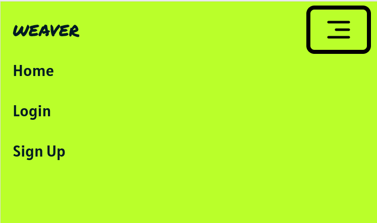

##### Signed-In Users
For people that have signed in, the Navigation Bar gives the Users easy acces to their profile.


##### Admins
Admins of the platform can reach the django admin panel easily through the Navigation bar.


#### User Account:
The User Accounts in this project are managed by the AllAuth Django package.

##### User Sign up
Users can register on the page with a username, an optional email, and password. After registration all their information is stored in the database.
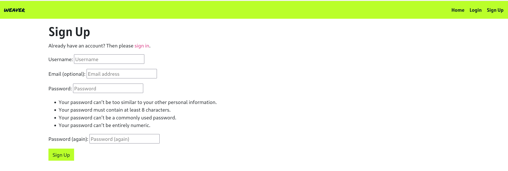

##### User Login
Registered users can log in to their accounts using their credentials.
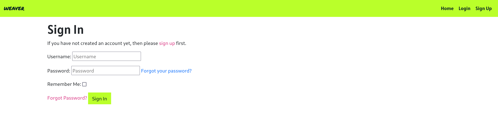

##### User Logout
Logged-in users can log out of the site by clicking the logout link in the navigation bar. They have to confirm their decision.
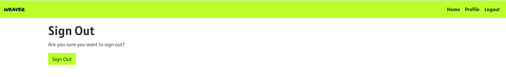

##### change Password
Registered users can reset their password.


##### Reset Password, through mail
If a user has entered a valid email adress, they can reset their password by mail with a verification link. This is especcilly usefull when the user has fergotten their password.
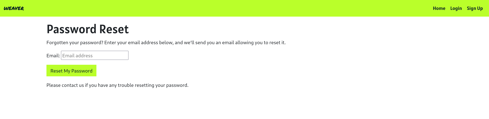

##### Delete User Account
Users have the option to delete their accounts, removing all associated content from the platform.

##### Access Settings
For easier acces to all options, settings are displayed on an additional page, making it easier for a user to find all possibile Account Options.\


#### Profile:
Each User on the platform has a User Profile.

##### Profile Picture and Bio
Each user has a profile where they can set a profile picture and update their bio text.
After signing up the user starts with a default picture and default bio text.\

 \
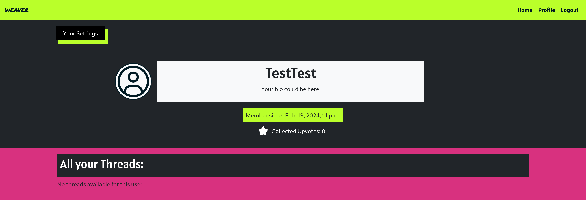

##### User Content Display
The profile displays all threads/posts created by the user.
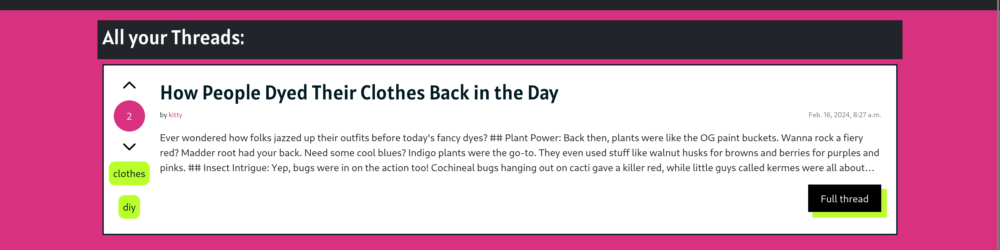 \
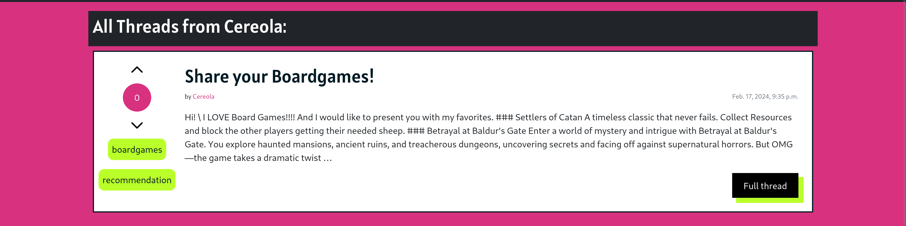

##### Vote Collection
Users can collect votes on their posts, threads, and comments. The total number of votes collected across all content is shown on the profile for each user.\
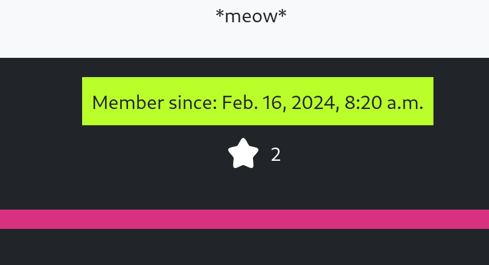

#### Threads, Comments, Votes:
On this platform Users engage by writing Threads. Each Thread can be commented.
Threads, as well as comments can be up- and down voted by Users.

##### Create Threads
Logged-in users can create threads on the platform. Threads appear in the global timeline and can be commented on by other logged-in users.\


##### Create Comments
Logged-in users can create comments on the platform. Comments appear below the thread they relate to.\


##### Upvote and Downvote
Users can upvote or downvote threads and comments to give and collect points on the platform.\
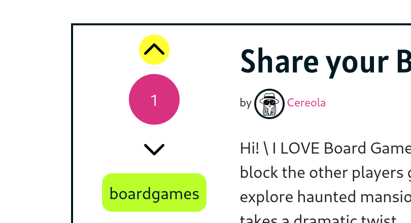

##### Edit Threads
Logged-in users can edit their threads  on the platform.\


##### Edit Comments
Logged-in users can edit their comments on the platform.\


##### Delete Threads and Comments
Logged-in users can delete their threads and comments. Confirmation is asked before the deletion is executed.\


##### Change or Delete Votes
Logged-in users can delete or change their votes on threads and comments.
The current vote of each user is displayed with a yellow background behind the up or downvote icon. If the opposite icon is pressed, the vote changes, if the current vote is pressed again, it is removed.\


#### Tags:
Each Thread can be created with tags. Tags can be followed by users to create personal timelines.

##### Tag Site
Each Tag has their own site, which desplayed all threads created with that tag.
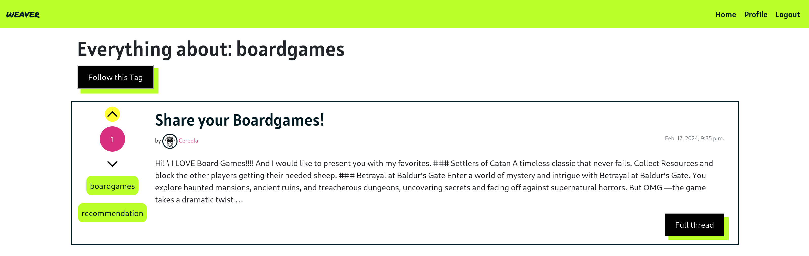

##### Follow Tags
On Tag Sites, the user has the option to follow a tag by pressing the botton on top of the site.\


##### Unfollow Tags
On Tag Sites, the user has an option to unfollow tags, if they follow them.\


##### Overview over all tags you follow
By navigating through the profile setting, a logged-in User can get to a view that shows them all tags they are following. This gives them an easier place to remove them.\


#### Global and Tag-based Timeline:

##### Global Timeline
The global timeline is visible to all Users and Visitors, showcasing threads from across the platform.
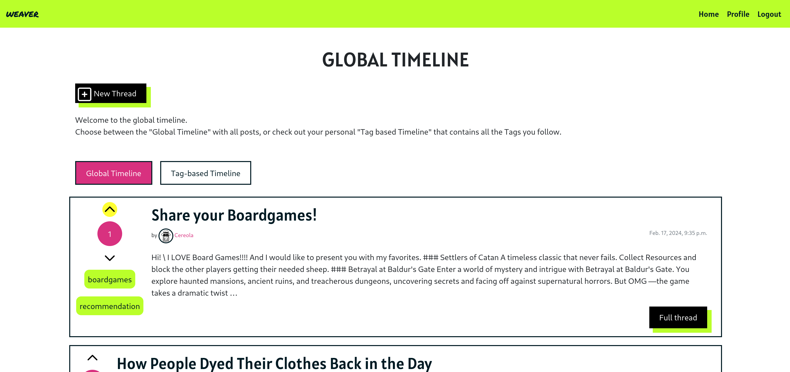

##### Personalized Tag Timeline
Users can follow tags, and threads with these tags appear in their personalized tag-based timeline for a tailored browsing experience.
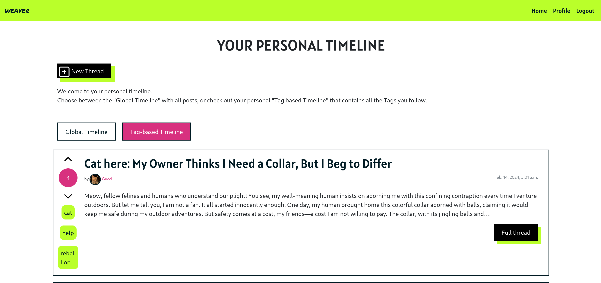

##### Pagination
For a better load time and usage with multiple threads, the timeline has a pagination feature.\


#### Messages
Users get notified about changes on the platform through the django message system.\
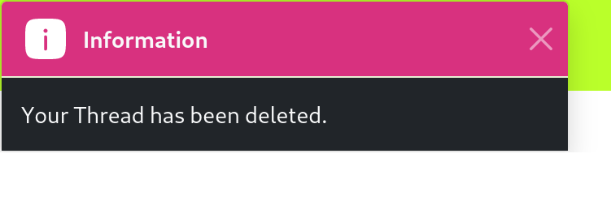

#### Django Admin Panel
Inside the Django Admin panel, Administrators have acces to the models of the django project.
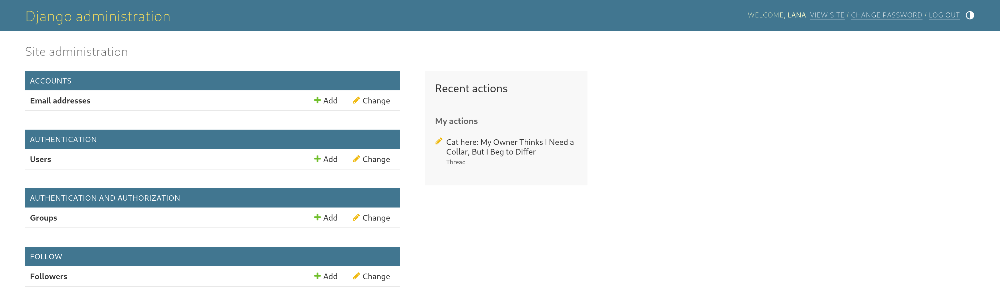

#### Info Page
An information page let's intrested visitors know what Weaver is all about.


### Features Left to Implement

#### Moderation:

* Flagging Content: Users can flag content for review by moderators if it violates community guidelines or is inappropriate.
* Moderator Role: Trusted users can be assigned a moderator role to review flagged content and take appropriate action.
* Content Review: Flagged content is accessible in a separate moderation view where moderators can review it and decide whether to delete or take further action.

#### Dark Mode:

* Color Preferences: Users can choose their color preferences for the site, including the option to switch to a dark mode theme for better visibility in low-light environments or personal preference.

### Accessibility

#### Fonts
The font 'Permanent Marker' was chosen as the font for the logo as well as logo related statement text. It is legible, but also rough and gritty. Breaking the clean visual of the site.

'Alatsi' was chosen for the Headings and Roboto for the general text. Both are easily readable and clean in their optic.

#### Colors
The website's style and vibe are defined by its color scheme. Chosen to resemble a neon spectrum, these colors are selected to provide strong contrast when combined.

#001A23, #FFFFFF, #BAFF2A, #F52789, #FFFF33


## Data

### Database schema
The Database was planned as the following:
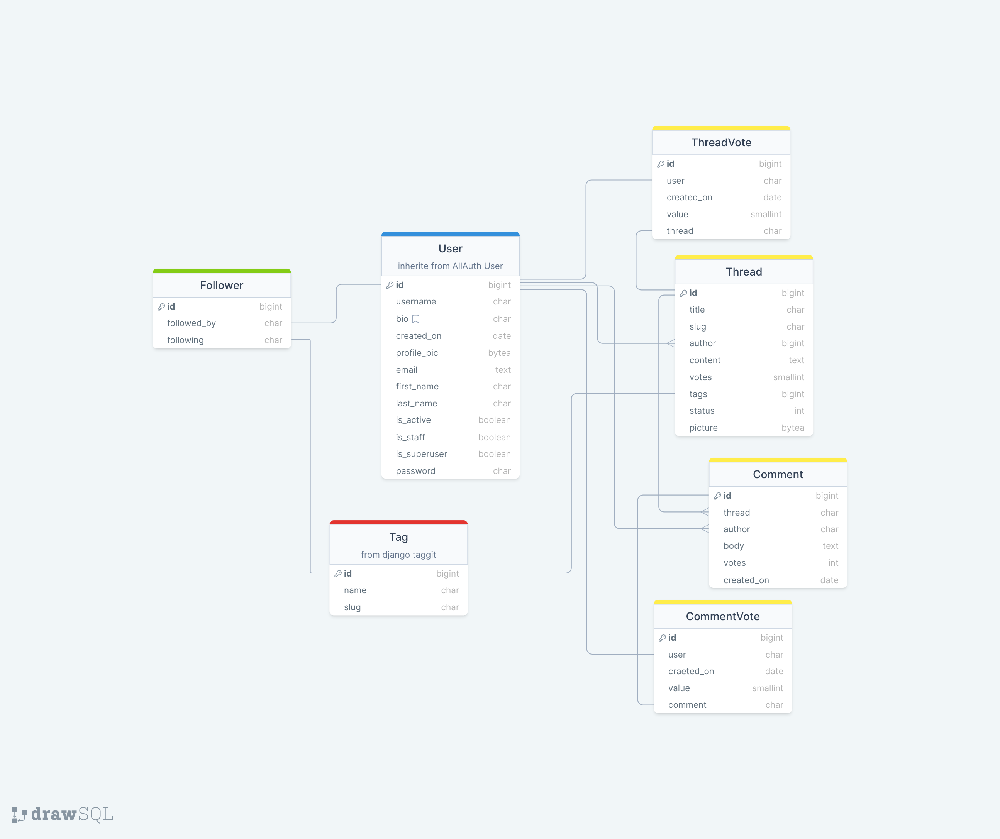
After realizing this project, the database structure is the following:
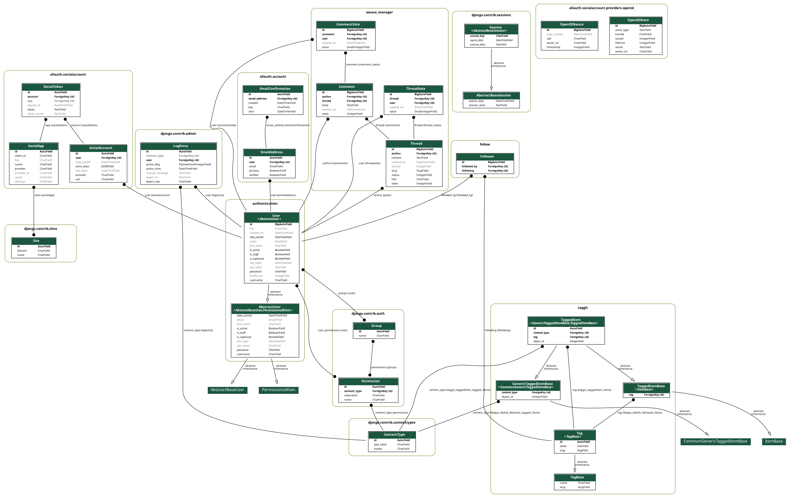
*Current Database Schema, exported with django-extensions*

## Security

I try to keep things in my Django project as secure as possible. I made sure that only logged-in users could do certain actions in the app. I did this by using the '@login_required' parameter in Django. For the class-based views, I relied on the LoginRequiredMixin mixin to make sure only authenticated users could access certain parts of the app.

If someone tries to do logged in required actions without logging in, they get redirected to the sign-in page.

The safety of user registration and login processes by integrating the AllAuth Django extension. This extension provides a robust framework for managing user authentication securely, offering features such as secure password storage and authentication workflows.

Sensitive information (such as the email adress) remains accessible only to authorized individuals, like admins an the owner of the data. Users are restricted from viewing or accessing sensitive data belonging to other users. This is due to the database, which requires a login.

## Testing

#### Lighthouse Test
The Lighthouse Test results show excellent results:


#### Jigsaw CSS Validator
The Jigsaw CSS Validator throws one error:
According to the test the Property *text-wrap: pretty* doesn't exist. In reality this is a [fairly new](https://developer.chrome.com/blog/css-text-wrap-pretty) css property. It is not yet implemented for all browser. *(see below)*


*Screenshot From [caniuse.com](https://caniuse.com/?search=text-wrap%3Apretty)*

#### W3C Validator
The W3C HTML Validator shows no errors.


#### Accessibility
The result of the WAVE Web Accessibility Evaluation Tool shows no Errors.


#### PEP8

The [Pep8 CI](https://pep8ci.herokuapp.com/) Linter was used, returning the following results:

| App            | File                 | CI Linter Result           |
|----------------|----------------------|----------------------------|
| authentication | forms.py             | All clear, no errors found |
|                | models.py            | All clear, no errors found |
|                | urls.py              | All clear, no errors found |
|                | views.py             | All clear, no errors found |
|                | tests/test_forms.py  | All clear, no errors found |
|                | tests/test_models.py | All clear, no errors found |
|                | tests/test_urls.py   | All clear, no errors found |
|                | tests/test_views.py  | All clear, no errors found |
| follow         | models.py            | All clear, no errors found |
|                | urls.py              | All clear, no errors found |
|                | views.py             | All clear, no errors found |
| weave_manager  | forms.py             | All clear, no errors found |
|                | models.py            | All clear, no errors found |
|                | urls.py              | All clear, no errors found |
|                | views.py             | All clear, no errors found |
|                | tests/test_form.py   | All clear, no errors found |
|                | tests/test_models.py | All clear, no errors found |
|                | tests/test_view.py   | All clear, no errors found |
|                | tests/test_voting.py | All clear, no errors found |

### Manual Testing

All main functionality was tested manually.

| Feature                                                | Expected Outcome                                                                                                                                                                                                                    | Testing Performed                                                                                             | Result                                                                                                                           | Pass/Fail |
|--------------------------------------------------------|-------------------------------------------------------------------------------------------------------------------------------------------------------------------------------------------------------------------------------------|---------------------------------------------------------------------------------------------------------------|----------------------------------------------------------------------------------------------------------------------------------|-----------|
| Sign Up                                                | When the User is signing up with valid credentials, an account should be created. After Signing up, the User is logged in.                                                                                                          | Signing up with username = test, email = test@test.de,  password = Secure123!                                 | The User is logged in. An Account has been created.                                                                              | Pass      |
| Invalid Sign Up                                        | When the User is signing in with invalid credentials, they get informed about the invalid data.                                                                                                                                     | Signing up with username = superlongusername123456789superlong, email = test(at)test.de, password = 123       | The User gets informed about an invalid email and password. The Username gets shorten to the appropriate length after creation.  | Pass      |
| Login                                                  | Can login in with the correct password and username.                                                                                                                                                                                | Login with username = test,  password = Secure123!                                                            | User is logged in.                                                                                                               | pass      |
| Invalid Login                                          | Users can't login with invalid credentials.                                                                                                                                                                                         | Login with username = test, password = InSecure123!                                                           | The user is not logged in.                                                                                                       | Pass      |
| Logout                                                 | After Confirming to logout, the user gets logged out.                                                                                                                                                                               | Pressing Button to confirm the logout.                                                                        | User is logged out.                                                                                                              | Pass      |
| User Profile                                           | Logged in Users can reach their Profile by pressing Profile in the Navbar.                                                                                                                                                          | Logging in. Pressing Profile.                                                                                 | The profile of the logged in user opens.                                                                                         | Pass      |
| Update Profile                                         | Users can update their bio and profile pic by selecting both under Your settings -> Update Profile.                                                                                                                                 | Logging in. Navigation to change profile. Update Bio and picture.                                             | Bio and picture changes to new data                                                                                              | Pass      |
| Clear Profile Picture and Bio                          | When changing the profile bio to empty and clear the profile picture, both should be removed.                                                                                                                                       | Clearing profile picture from form and leave the bio empty.                                                   | Profile picture is removed, default profile picture is displayed. Bio is removed.                                                | Pass      |
| Changing Password                                      | Setting a new password results in new login credentials.                                                                                                                                                                            | Changing password. Logout. Login with old credentials. Login with new credentials.                            | Login with old password does not work, Login in with new password is successful.                                                 | Pass      |
| Add email                                              | Adding a new email with Your Settings -> Update email should result in connecting a new email with the user.                                                                                                                        | Adding a new email.                                                                                           | Email successfull displayed.                                                                                                     | Pass      |
| Reset password by mail                                 | When pressing the "forgotten password" option and entering an email, a verification email is send. In this email a link can be pressed to reset the password.                                                                       | Entering an email adress and reset a password.                                                                | An email with an link to reset the password arrives. pressing the link gives the option to rest a password.                      | Pass      |
| Delete Profile                                         | After confirming the deletion a user account should get deleted. All threads, comments and votes made by the user should get deleted with it.                                                                                       | Confirming the Delete of User profile.                                                                        | User is logged out. Account is delted. All threads, comments and votes by this user are gone.                                    | Pass      |
| Thread Creation                                        | Valid Data should create a new thread. The thread gets displayed in the global timeline under the users threads and on the site of the uses tag. If the user follows the used tag, the thread gets shown in the tag based timeline. | create a thread. Title = "This is a test", content = "This should work.", tags = "test". Follow the tag test. | The thread is created. The thread shows in the global timline, tagbased timelin, on my profile and on the tag site of test.      | Pass      |
| Invalid Thread Creation                                | Invalid threads should not be accepted.                                                                                                                                                                                             | Tryingt to create an empty thread.                                                                            | fields that can not be empty show errors.                                                                                        | Pass      |
| Create Thread with picture                             | When creating a thread with a picture, the picture should be shown in the thread detail.                                                                                                                                            | Creating a thread with a picture.                                                                             | The picture shows up in the thread detail.                                                                                       | Pass      |
| Change Picture in thread                               | When a thread is edited and a picture is changed. The new picture is shown in the thread detail.                                                                                                                                    | Creating a thread with picture 1. Edit the thread to picture 2.                                               | Picture 2 is shown in the thread detail.                                                                                         | Pass      |
| Clear Picture in thread                                | When a picture is cleared from a thread, it should be removed from the thread detail.                                                                                                                                               | Creating a thread with picture. Remove Pic.                                                                   | Picture is remove from thread.                                                                                                   | Pass      |
| Markdown in threads                                    | When using markdown formatting in thread content, the correct markdown styling is displayed.                                                                                                                                        | A thread with the content "#This is a test / Does *this* work?" is created.                                   | Markdown styling is shown in the thread detail site.                                                                             | Pass      |
| Leaving a Comment                                      | Logged in Users can leave a comment under a thread.                                                                                                                                                                                 | Opening a thread. Filling out the comment form. submit the form.                                              | The comment gets displayed under the thread.                                                                                     | Pass      |
| Markdown for Comments                                  | Comments have markdown styling.                                                                                                                                                                                                     | Trying "## Hey / Does *this* work?" in the body of the of the comment. submit comment.                        | Markdown formatting is displayed.                                                                                                | Pass      |
| Tag Site                                               | When pressing on a tag, logged in users should see a follow and unfollow option. All threads with this tag sgould be displayed.                                                                                                     | Clicking on a tag.                                                                                            | The tag sites with the unfollow/follow button opens. All threads with this tag are displayed.                                    | Pass      |
| Follow a tag                                           | When a user is not following a tag the option "follow this tag" is presented on the tag site. A click makes the user follow the tag. All threads with this tag now appear in the tag based timeline.                                | Clicking "follow this tag" on tag site.                                                                       | button changes to "unfollow this tag", seeing all threads with this tag in the tag based timeline.                               | Pass      |
| Unfollow a tag                                         | When a user unfollows a tag, all threads with this tag are getting removed from the tag based timeline.                                                                                                                             | Clicking "unfollow ths tag" on tag site.                                                                      | No threads with this tag show in the tag based timeine. Button changes to "follow this tag"                                      | Pass      |
| Global Timeline                                        | The global timeline shows all threads.                                                                                                                                                                                              | Entering global timeline.                                                                                     | It shows all threads.                                                                                                            | Pass      |
| Info for unregistered User                             | Users who haven't sign up yet should get a cool header, as well as a info what weaver is all about.                                                                                                                                 | Header on the landing page is shown. Login. Header is removed.                                                | Header is only visible for not logged in users.                                                                                  | Pass      |
| Tag based Timeline.                                    | Users should have the option to visit the tag based timeline after logging in. The tag based timeline only shows threads containg tags a user is following.                                                                         | Login. Choose Tagbased Timeline.                                                                              | The List of threads only contain threads with the tags the user follows.                                                         | Pass      |
| Upvoting Thread                                        | After pressing the arrow up next to the thread / above the vote count, the vote should count should move 1 up and the arrow up get a yellow background.                                                                             | Pressing the arrow up.                                                                                        | The vote counts +1, the arrow up gets a yellow background.                                                                       | Pass      |
| Downvoting Thread                                      | After pressing the arrow down, the vote should count -1 and the down arrow should get a yellow background highlight.                                                                                                                | Pressing the arrow down.                                                                                      | The vote vount is -1, the arrow down has a yellow background.                                                                    | Pass      |
| Changing the vote from Upvote to Downvote              | When the user decides to change their vote from an Up to a Downvote, the application should react accordingly.                                                                                                                      | Upvoting a thread. Downvoting a thread.                                                                       | The vote count removed the upvote and entered a downvote. Now the downvote has a yellow background.                              | Pass      |
| Changing from Downvote to Upvote                       | When the user decides to change their vote from a Downvote to an Upvote, the application should react accordingly.                                                                                                                  | Downvoting a thread. Upvoting a thread.                                                                       | The count removed the Down vote and adds the upvote. the upvote has a yellow background.                                         | Pass      |
| Removing an upvote on a thread.                        | By pressing on an already made upvote, the vote should be removed.                                                                                                                                                                  | Upvoting. Upvoting again.                                                                                     | the vote is removed. No arrow has a yellow background.                                                                           | Pass      |
| Removing a downvote on a thread.                       | By pressing on an already made downvote, the vote should be removed.                                                                                                                                                                | Downvoting. Downvoting again.                                                                                 | the vote is removed. No arrow has a yellow background.                                                                           | Pass      |
| Upvoting comment                                       | After pressing the arrow up next to the comment / above the vote count, the vote should count should move 1 up and the arrow up get a yellow background.                                                                            | Pressing the arrow up.                                                                                        | The vote counts +1, the arrow up gets a yellow background.                                                                       |           |
| Downvoting comment                                     | After pressing the arrow down, the vote should count -1 and the down arrow should get a yellow background highlight.                                                                                                                | Pressing the arrow down.                                                                                      | The vote vount is -1, the arrow down has a yellow background.                                                                    |           |
| Changing the vote from Upvote to Downvote on a comment | When the user decides to change their vote from an Up to a Downvote, the application should react accordingly.                                                                                                                      | Upvoting a comment. Downvoting a comment.                                                                     | The vote count removed the upvote and entered a downvote. Now the downvote has a yellow background.                              |           |
| Changing from Downvote to Upvote on a comment          | When the user decides to change their vote from a Downvote to an Upvote, the application should react accordingly.                                                                                                                  | Downvoting a comment. Upvoting a comment.                                                                     | The count removed the Down vote and adds the upvote. the upvote has a yellow background.                                         |           |
| Removing an upvote on a comment.                       | By pressing on an already made upvote, the vote should be removed.                                                                                                                                                                  | Upvoting. Upvoting again.                                                                                     | the vote is removed. No arrow has a yellow background.                                                                           |           |
| Removing a downvote on a comment.                      | By pressing on an already made downvote, the vote should be removed.                                                                                                                                                                | Downvoting. Downvoting again.                                                                                 | the vote is removed. No arrow has a yellow background.                                                                           |           |

### Automatic Testing
This project contains Unittests to automatically test the application.

Coverage Report, creates by coverage:

| Name                                                                                        |    Stmts |     Miss |   Cover |   Missing |
|-------------------------------------------------------------------------------------------- | -------: | -------: | ------: | --------: |
| authentication/\_\_init\_\_.py                                                              |        0 |        0 |    100% |           |
| authentication/admin.py                                                                     |        8 |        0 |    100% |           |
| authentication/apps.py                                                                      |        4 |        0 |    100% |           |
| authentication/forms.py                                                                     |       25 |        2 |     92% |     13-14 |
| authentication/migrations/0001\_initial.py                                                  |        8 |        0 |    100% |           |
| authentication/migrations/0002\_alter\_user\_bio\_alter\_user\_profile\_pic.py              |        4 |        0 |    100% |           |
| authentication/migrations/0003\_alter\_user\_profile\_pic\_alter\_user\_username.py         |        4 |        0 |    100% |           |
| authentication/migrations/0004\_alter\_user\_bio\_alter\_user\_profile\_pic.py              |        4 |        0 |    100% |           |
| authentication/migrations/\_\_init\_\_.py                                                   |        0 |        0 |    100% |           |
| authentication/models.py                                                                    |       10 |        0 |    100% |           |
| authentication/tests/\_\_init\_\_.py                                                        |        0 |        0 |    100% |           |
| authentication/tests/test\_forms.py                                                         |       10 |        0 |    100% |           |
| authentication/tests/test\_models.py                                                        |       13 |        0 |    100% |           |
| authentication/tests/test\_urls.py                                                          |       10 |        0 |    100% |           |
| authentication/tests/test\_views.py                                                         |       59 |        0 |    100% |           |
| authentication/urls.py                                                                      |        4 |        0 |    100% |           |
| authentication/views.py                                                                     |       63 |        2 |     97% |    71, 91 |
| follow/\_\_init\_\_.py                                                                      |        0 |        0 |    100% |           |
| follow/admin.py                                                                             |        3 |        0 |    100% |           |
| follow/apps.py                                                                              |        4 |        0 |    100% |           |
| follow/migrations/0001\_initial.py                                                          |        7 |        0 |    100% |           |
| follow/migrations/\_\_init\_\_.py                                                           |        0 |        0 |    100% |           |
| follow/models.py                                                                            |       10 |        1 |     90% |        16 |
| follow/tests/\_\_init\_\_.py                                                                |        0 |        0 |    100% |           |
| follow/tests/test\_views.py                                                                 |        0 |        0 |    100% |           |
| follow/urls.py                                                                              |        3 |        0 |    100% |           |
| follow/views.py                                                                             |       42 |       31 |     26% |9-30, 34-53, 61-62 |
| manage.py                                                                                   |       12 |        2 |     83% |     12-13 |
| weave\_manager/\_\_init\_\_.py                                                              |        0 |        0 |    100% |           |
| weave\_manager/admin.py                                                                     |        6 |        0 |    100% |           |
| weave\_manager/apps.py                                                                      |        4 |        0 |    100% |           |
| weave\_manager/forms.py                                                                     |       24 |        0 |    100% |           |
| weave\_manager/migrations/0001\_initial.py                                                  |        8 |        0 |    100% |           |
| weave\_manager/migrations/0002\_rename\_thread\_comment\_thread\_commentvote\_threadvote.py |        6 |        0 |    100% |           |
| weave\_manager/migrations/0003\_remove\_comment\_votes\_remove\_thread\_votes.py            |        4 |        0 |    100% |           |
| weave\_manager/migrations/0004\_thread\_votes\_alter\_commentvote\_comment\_and\_more.py    |        6 |        0 |    100% |           |
| weave\_manager/migrations/0005\_comment\_votes.py                                           |        4 |        0 |    100% |           |
| weave\_manager/migrations/0006\_alter\_thread\_slug.py                                      |        4 |        0 |    100% |           |
| weave\_manager/migrations/0007\_thread\_picture.py                                          |        4 |        0 |    100% |           |
| weave\_manager/migrations/\_\_init\_\_.py                                                   |        0 |        0 |    100% |           |
| weave\_manager/models.py                                                                    |      145 |       20 |     86% |33, 48-53, 90-93, 120, 155-158, 176, 188, 195-196, 204-205 |
| weave\_manager/tests/\_\_init\_\_.py                                                        |        0 |        0 |    100% |           |
| weave\_manager/tests/test\_forms.py                                                         |       65 |        0 |    100% |           |
| weave\_manager/tests/test\_models.py                                                        |       66 |        0 |    100% |           |
| weave\_manager/tests/test\_views.py                                                         |       53 |        6 |     89% |     81-91 |
| weave\_manager/tests/test\_voting.py                                                        |      139 |        0 |    100% |           |
| weave\_manager/urls.py                                                                      |        3 |        0 |    100% |           |
| weave\_manager/views.py                                                                     |      182 |       73 |     60% |44-49, 52-58, 74-78, 86-87, 90-109, 140-151, 156-166, 214-220, 228-238, 243-256, 262-273 |
| wordweave/\_\_init\_\_.py                                                                   |        0 |        0 |    100% |           |
| wordweave/asgi.py                                                                           |        4 |        4 |      0% |     10-16 |
| wordweave/settings.py                                                                       |       57 |       14 |     75% |35, 145, 216-220, 224-230 |
| wordweave/urls.py                                                                           |        6 |        0 |    100% |           |
| wordweave/wsgi.py                                                                           |        4 |        4 |      0% |     10-16 |
|                                                                                   **TOTAL** | **1101** |  **159** | **86%** |

The tests run without any Errors:
´´´
Using python3 (3.12.1)
Found 46 test(s).
Creating test database for alias 'default'...
System check identified no issues (0 silenced).
./home/lana/.cache/pypoetry/virtualenvs/wordweave-jm8Ce3Z9-py3.12/lib/python3.12/site-packages/django/core/handlers/base.py:61: UserWarning: No directory at: /home/lana/Projects/WordWeave/staticfiles/
  mw_instance = middleware(adapted_handler)
.............................................
----------------------------------------------------------------------
Ran 46 tests in 24.402s

OK
Destroying test database for alias 'default'...
´´´    

### Unfixed Bugs

#### Redirect After Voting on Threads
When the user votes on threads, they always get redirected to the Global Timeline.
Therefore the user always looses the site the were on.
This is especially problematic when voting threads on another Users profile, since the design changes drasticlly with a redirect to the global timeline.

##### Possible Solutions
A parameter containing the previous url, or url name, needs to be passed down when voting.
This way a redirect can redirecting the User to the previous page after voting.
Now there still might be the issue that the user voted on the bottom of the page, but gets redirected to the top.
Each thread yould have an id, to redirect to in the url.

Another and probably better version would be to handle the voting with a JavaScript Function.
This way a redirect is not needed and the voting can happen in the background. 

### Fixed Bugs
#### Cascading Deletes for Votes
##### The Situation:
When a user deletes their profile, all threads, comments and votes the user has made on the platform should get deleted with it. 
The current set up is as followed:

```

class Thread(models.Model):
    (...)

    def up_vote(self, user):
        # Check if the user has already voted for the thread
        if not self.thread_votes.filter(user=user).exists():
            self.votes = F('votes') + 1
            self.save()
            self.thread_votes.create(user=user, value=1)
        elif self.thread_votes.get(user=user, thread_id=self.id).value == -1:
            self.votes = F('votes') + 2
            self.save()
            vote = self.thread_votes.get(user=user, thread_id=self.id)
            vote.value = 1
            vote.save()
        # Here need to come an exception that gets handle to inform the user that they have already voted.

    def down_vote(self, user):
        # Check if the user has already voted for the thread
        if not self.thread_votes.filter(user=user).exists():
            self.votes = F('votes') - 1
            self.save()
            self.thread_votes.create(user=user, value=-1)
        elif self.thread_votes.get(user=user, thread_id=self.id).value == 1:
            self.votes = F('votes') - 2
            self.save()
            vote = self.thread_votes.get(user=user, thread_id=self.id)
            vote.value = -1
            vote.save()

class ThreadVote(models.Model):
    user = models.ForeignKey(settings.AUTH_USER_MODEL, on_delete=models.CASCADE)
    created_on = models.DateTimeField(auto_now_add=True)
    value = models.SmallIntegerField()
    thread = models.ForeignKey(Thread, on_delete=models.CASCADE, related_name="thread_votes")

```

##### The Problem:
After Deleting a User, their votes (as instances of the Vote Model) get deleted, but the value "votes" of the Thread itselfs is never. Since the Votes for each thread is are the Thread.values that get displayed. The Votes in the website are never updated.

##### The Solution:
The goal is to create a function within the ThreadVote Model that updates the value of the associated thread whenever a ThreadVote is deleted.

I tried this by overwriting the delete() function.

```
class ThreadVote(models.Model):
    user = models.ForeignKey(settings.AUTH_USER_MODEL, on_delete=models.CASCADE)
    created_on = models.DateTimeField(auto_now_add=True)
    value = models.SmallIntegerField()
    thread = models.ForeignKey(Thread, on_delete=models.CASCADE, related_name="thread_votes")

    def delete(self, *args, **kwargs):
        # Update the thread's vote count before deleting the vote instance
        if self.value == 1:
            self.thread.votes = F('votes') - 1
        elif self.value == -1:
            self.thread.votes = F('votes') + 1

        self.thread.save()
        super().delete(*args, **kwargs)
```

The issue arose because, contrary to expectations, an overwritten delete function is not utilized for cascading deletes. Following the recommendation in the Django Docs to use pre_delete resolved the issue effectively.

```
@receiver(pre_delete, sender=ThreadVote)
def update_thread_votes(sender, instance, **kwargs):
    if instance.value == 1:
        instance.thread.votes = F('votes') - 1
    elif instance.value == -1:
        instance.thread.votes = F('votes') + 1
    instance.thread.save()
```
#### Default Pictures get deleted
##### The Situation:
After signing up the user recieves a default profile picture.
The moment any user changes their profile picture, it is gone for everyone.

##### The Problem:
With the storage of pictures in the cloud bucket, it was implemented that the old picture was deleted the moment one of the users deletes their profile picture by chooseing a new one, the default image gets deleted from the bucket.

##### The Solution:
To solve this problem the default picture was removed as a concept from the model and instead implemented in form of a fallback inside the template itself.
The default profile picture is now safely stored inside the static files and can not be deleted by users.

**Before:**
```
<div class="pt-5 d-flex md-rows align-items-center w-100 max-w-75">
    
    <div class="bg-light text-dark w-75 p-2 m-3 text-center">
        <h1>{{ user.username }}</h1>
        <p>{{ user.bio }}</p>
    </div>
</div>
```

**After:**
```
<div class="pt-5 d-flex md-rows align-items-center w-100 max-w-75">
    
    
    
    
    
    <div class="bg-light text-dark w-75 p-2 m-3 text-center">
        <h1>{{ user.username }}</h1>
        <p>{{ user.bio }}</p>
    </div>
</div>
```

## Deployment

### Local Development

#### How to Clone

1. Click the code button and copy the link of your preferred clone option.
2. Open the terminal in your code editor and change the current working directory to the location you want to use for the cloned directory.
3. Type 'git clone' into the terminal, paste the link you copied in step 1 and press enter.

More detailed steps are provided by github: [github guide to clone a repository](https://docs.github.com/en/repositories/creating-and-managing-repositories/cloning-a-repository)


#### How to Fork

To fork the repository:

1. Log in (or sign up) to Github.
2. Go to the repository for this project.
3. Click the Fork button in the top right corner.

### Deploy locally

Install poetry.
To install the  dependencies for this project, run:
```
poetry install
```

To navigate the project, use the django-admin is Django’s command-line utility for administrative tasks. This [django docs](https://docs.djangoproject.com/en/5.0/ref/django-admin/) outlines all it can do.

#### Usage
django commands follow the following pattern:

```
$ django-admin <command> [options]
$ manage.py <command> [options]
$ python -m django <command> [options]
```

**Development**

```
python manage.py runserver
```
Starts a lightweight development web server on the local machine.

### Deployment Using Heroku

1. Register for an account on Heroku or sign in.
2. Create a new app.
3. Name your App.
5. Connect your github repository to Heroku app.
6. Create a Live Database by adding the postgreSQL add-on.
7. Create a Cloudfare Account and set up a R2 Bucket.
8. Create and Set up an email account for verification mails.
9. Set Config Vars for your cloudfare bucket (*AWS_S3_SECRET_ACCESS_KEY*), database (*DATABASE_URL*) and email(*EMAIL_HOST_PASSWORD*).
10. Deploy from "deploy", or choose an automatic deploy option.

## Credits
* Markdown Table of Content by [Jon Schlinkert](https://github.com/jonschlinkert/markdown-toc)
* The user story structure was used from the [Atlassian Archive](https://community.atlassian.com/t5/Jira-Content-Archive-questions/Default-Description-Text-on-Create/qaq-p/2359579)
* The Tags in this project are provided by [django-taggit](https://github.com/jazzband/django-taggit)
* The default profile picture is by [freepik](https://de.freepik.com/vektoren-kostenlos/handgezeichnetes-flaches-profilsymbol_17539361.htm#query=profile%20picture&position=42&from_view=search&track=ais&uuid=594c74d8-53ba-48f7-9d10-3770ce010d32)
* The navbar icon is from [flaticon](https://www.flaticon.com/free-icon/menu-bar_8860952?term=navigation&page=1&position=42&origin=search&related_id=8860952)
* The [django-image-uploader-widget](https://pypi.org/project/django-image-uploader-widget/) was used for the profile image
* [DrawSQL](https://drawsql.app/) was used to create the database sketch and [django-extensions](https://django-extensions.readthedocs.io/en/latest/graph_models.html) for the final export. 
* I learned a lot about django unittests from 
[The Dumbfounds](https://www.youtube.com/watch?v=0MrgsYswT1c&list=PLbpAWbHbi5rMF2j5n6imm0enrSD9eQUaM&index=2)
* All svg icons come from [svgrepo](https://www.svgrepo.com/svg/513800/add-square)
* Avatar Images are free images from [freepik](https://www.freepik.com/free-vector/hand-drawn-people-avatar-set_4077151.htm#from_view=detail_alsolike)
* This project uses image resizing by the [django imagekit](https://github.com/matthewwithanm/django-imagekit)
* [follow and unfollow concept](https://www.youtube.com/watch?v=vFWobmzLUII)
* django [pagination](https://dontrepeatyourself.org/post/django-pagination-with-class-based-view/)
* The markdown in threads get handled with [markdown2](https://pypi.org/project/django-markdown2/)
* Set Up R2 Bucket from [djangotherightway](https://djangotherightway.com/using-cloudflare-r2-with-django-for-storage)