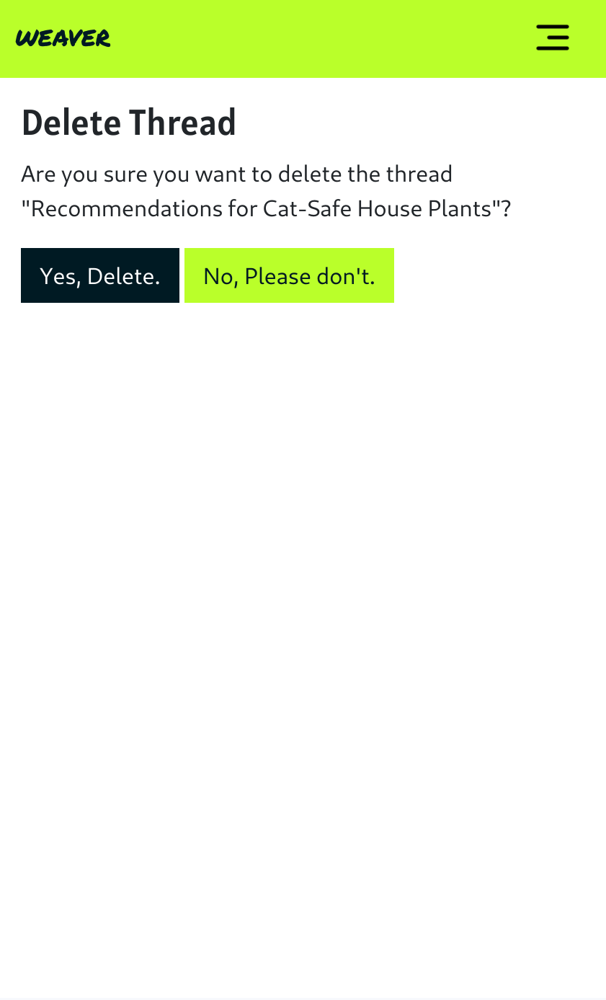
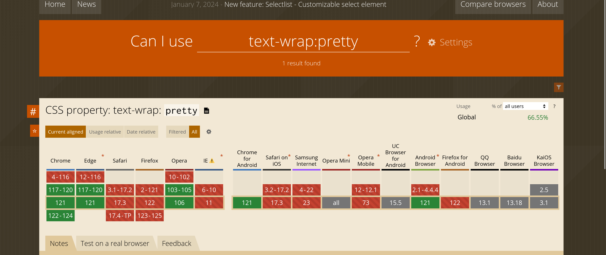

# Weaver

Weaver is Reddit style news site. Users can create Threads on diverse topics and sparking discussions. Each Thread functions as a dynamic structure where users can share insights, opinions, and reactions through comments. With the ability to upvote/downvote Threads and comments, users actively shape the narrative and show their support or dislike.

Behind the scenes, Weaver is powered by Python, using a Django web framework. The user interface is crafted using Boostrap CSS and JavaScript. Furthermore, Weaver is deployed on Heroku, a cloud platform as a service (PaaS).

You can check out the [live-site.](https://word-weave-eb35426ae0cb.herokuapp.com/)


## Content

<!-- toc -->

- [Technologies Used](#technologies-used)
  * [Languages Used](#languages-used)
  * [Frameworks, Libraries & Programs Used](#frameworks-libraries--programs-used)
- [User Experience](#user-experience)
  * [Target Audience](#target-audience)
  * [User stories](#user-stories)
    + [Workflow](#workflow)
- [Design](#design)
  * [Wireframes](#wireframes)
    + [Timeline](#timeline)
    + [Profile](#profile)
- [Features](#features)
  * [Existing Features](#existing-features)
    + [User Account:](#user-account)
    + [Profile:](#profile)
    + [Threads, Comments, Votes:](#threads-comments-votes)
    + [Tags:](#tags)
    + [Global and Tag-based Timeline:](#global-and-tag-based-timeline)
  * [Features Left to Implement](#features-left-to-implement)
    + [Moderation:](#moderation)
    + [Dark Mode:](#dark-mode)
  * [Accessibility](#accessibility)
    + [Fonts](#fonts)
    + [Colors](#colors)
    + [Structural HTML](#structural-html)
- [Testing](#testing)
    + [Lighthouse Test](#lighthouse-test)
    + [Jigsaw CSS Validator](#jigsaw-css-validator)
    + [W3C Validator](#w3c-validator)
    + [Accessibility](#accessibility-1)
    + [JS Hint](#js-hint)
  * [Manual Testing](#manual-testing)
  * [Automatic Testing](#automatic-testing)
  * [Unfixed Bugs](#unfixed-bugs)
  * [Fixed Bugs](#fixed-bugs)
  * [The Situation:](#the-situation)
  * [The Problem:](#the-problem)
  * [Solution:](#solution)
- [Deployment](#deployment)
  * [Local Development](#local-development)
    + [How to Clone](#how-to-clone)
    + [How to Fork](#how-to-fork)
  * [Deploy locally](#deploy-locally)
    + [Usage](#usage)
  * [Deployment Using Heroku](#deployment-using-heroku)
- [Credits](#credits)

<!-- tocstop -->

## Technologies Used

* GitHub – storage and deployment
* Sublime Text - Editor
* Heroku - Deployment
* Cloudflare R2 Storage - Cloud storage for non static images
* [Poetry](https://python-poetry.org/) - dependency management and packaging in Python

### Languages Used

Python, HTML/CSS, Java Script

### Frameworks, Libraries & Programs Used

* Git / Github
* [django-allauth](https://docs.allauth.org/en/latest/)
* [django-crispy-forms](https://django-crispy-forms.readthedocs.io/en/latest/)
* [pillow Imaging Library](https://pypi.org/project/pillow/)
* [django-taggit](https://github.com/jazzband/django-taggit)
* [markdown2](https://pypi.org/project/django-markdown2/)
* [django-image-uploader-widget](https://pypi.org/project/django-image-uploader-widget/)
* django-storages and boto3, for r2 bucket storage

## User Experience

### Target Audience

The target audience for Weaver includes creators, enthusiasts, and curious minds with a focus on engaging young and hip generations through its modern and vibrant design. These individuals are passionate about engaging in conversations on the platform or sharing ideas in the comment section. 

### User stories
Features in this project are structured through [user stories](https://github.com/DasUnicorn/WordWeave/issues?q=is%3Aissue).
Each User Story contains:
- **Dependencies:** This field indicates any external factors or requirements that need to be fulfilled before the user story can be implemented in a form of a list of other user stories.
- **Description Of Service Or Screen:** This field typically describes the specific service, feature, or screen that the user story relates to.
- **User Objective:** This field outlines the user's goal or objective. It should clearly state what the user wants to achieve or accomplish. The format follows: "As a user, I want to [action], so that [reason or benefit]."
- **Acceptance Criteria:** This field specifies the conditions or criteria that must be met for the user story to be considered complete. It helps define the boundaries and expectations for implementing the user story.

#### Workflow
In the development process, a Kanban board in form of a [github project](https://github.com/users/DasUnicorn/projects/2) is used to manage the tasks and track their progress. Initially, all issues are collected and placed in the backlog. During each iteration, a set number of issues are selected to be developed and assigned to the current milestone. These selected issues are then moved to the 'To Do' column on the Kanban board, indicating that they are ready to be worked on.

When working on the tasks begins, the status of the issues is updated to 'In Process'. This signifies that active development is underway. Once the development work is completed, the issues move to the 'Testing' column, where they undergo thorough testing to ensure the acceptions criterias are met.

If an issue passes testing successfully, it is considered 'Done' and is moved to the final column on the Kanban board.

If an issue encounters blockers or dependencies that prevent progress, it is moved to the 'Waiting' column. Here, it remains until the blockers are resolved, allowing work to resume.

Throughout its journey, from 'To Do' to 'Testing' and ultimately 'Done', detailed information including comments, Git commits, and testing results is added to each issue. This approach ensures transparency regarding the path and work undertaken for every issue.


## Design
The design process began with the creation of [three concepts:](https://www.figma.com/file/kyb4eClnCRghZT5nCFtHZ7/Untitled?type=whiteboard&node-id=0%3A1&t=HesaSLC53DPFYpXK-1) a retro-inspired theme featuring nostalgic colors and forms, a modern and elegant approach with sleek lines and refined aesthetics, and a hip neon profile.

These concepts were presented to other people for feedback and evaluation. Their insights and preferences were carefully considered to for each design. After thorough deliberation, the trendy cool neon design was the favored choice. Its vibrant colors, dynamic elements, and modern flair resonated most strongly with the audience.


### Wireframes

#### Timeline
**Desktop:** \
 \
**Mobile:** \


#### Profile
**Desktop:** \
 \
**Mobile:** \


## Features 

### Existing Features

#### User Account:

* Sign up: Users can register on the page with a username, an optional email, and password.
* Login: Registered users can log in to their accounts using their credentials.
* Delete Account: Users have the option to delete their accounts, removing all associated content from the platform.
* Change Password: Users can change their passwords for better security
 \

* Passwort Reset: Users can reset their Password per mail. This only works when an email has been entered.
* Settings: For easier acces to all option, settings are displayed on an additional page
 \

#### Profile:

* User Profile and Bio: Each user has a profile where they can set a profile picture and update their bio text.
 \
 \

* User Content Display: The profile displays all threads/posts created by the user.
* Vote Collection: Users can collect votes on their posts, threads, and comments. The total number of votes collected across all content is shown on the profile.


#### Threads, Comments, Votes:

* Create Threads and Comments: Logged-in users can create threads and comments on the platform. Threads appear in the global timeline and can be commented on by other logged-in users.


* Upvote and Downvote: Users can upvote or downvote threads and comments to give and collect points on the platform.
* Edit: Logged-in users can edit their threads and comments on the platform.


* Delete: Logged-in users can delete their threads and comments. Confirmation is asked before the deletion is executed.



#### Tags:
* Follow Tags


* Unfollow Tags


* Overview over all tags you follow:


#### Global and Tag-based Timeline:

* Global Timeline: The global timeline is visible to all users, showcasing threads from across the platform.
* Personalized Tag Timeline: Users can follow tags, and threads with these tags appear in their personalized tag-based timeline for a tailored browsing experience.

* Pagination: For a better load time and usage with multiple threads.


### Features Left to Implement

#### Moderation:

* Flagging Content: Users can flag content for review by moderators if it violates community guidelines or is inappropriate.
* Moderator Role: Trusted users can be assigned a moderator role to review flagged content and take appropriate action.
* Content Review: Flagged content is accessible in a separate moderation view where moderators can review it and decide whether to delete or take further action.

#### Dark Mode:

* Color Preferences: Users can choose their color preferences for the site, including the option to switch to a dark mode theme for better visibility in low-light environments or personal preference.

### Accessibility

#### Fonts
The font 'Permanent Marker' was chosen as the font for the logo as well as logo related statement text. It is legible, but also rough and gritty. Breaking the clean visual of the site.

'Alatsi' was chosen for the Headings and Roboto for the general text. Both are easily readable and clean in their optic.

#### Colors
The website's style and vibe are defined by its color scheme. Chosen to resemble a neon spectrum, these colors are selected to provide strong contrast when combined.

#001A23, #FFFFFF, #BAFF2A, #F52789, #FFFF33


## Testing

#### Lighthouse Test
The Lighthouse Test results show excellent results:


#### Jigsaw CSS Validator
The Jigsaw CSS Validator throws one error:
According to the test the Property *text-wrap: pretty* doesn't exist. In reality this is a [fairly new](https://developer.chrome.com/blog/css-text-wrap-pretty) css property. It is not yet implemented for all browser. *(see below)*


*Screenshot From [caniuse.com](https://caniuse.com/?search=text-wrap%3Apretty)*

#### W3C Validator
The W3C HTML Validator shows no errors.


#### Accessibility
The result of the WAVE Web Accessibility Evaluation Tool shows no Errors.


### Manual Testing

### Automatic Testing
Unittests

### Unfixed Bugs

### Fixed Bugs
#### Cascading Deletes for Votes
##### The Situation:
When a user deletes their profile, all threads, comments and votes the user has made on the platform should get deleted with it. 
The current set up is as followed:

```

class Thread(models.Model):
    (...)

    def up_vote(self, user):
        # Check if the user has already voted for the thread
        if not self.thread_votes.filter(user=user).exists():
            self.votes = F('votes') + 1
            self.save()
            self.thread_votes.create(user=user, value=1)
        elif self.thread_votes.get(user=user, thread_id=self.id).value == -1:
            self.votes = F('votes') + 2
            self.save()
            vote = self.thread_votes.get(user=user, thread_id=self.id)
            vote.value = 1
            vote.save()
        # Here need to come an exception that gets handle to inform the user that they have already voted.

    def down_vote(self, user):
        # Check if the user has already voted for the thread
        if not self.thread_votes.filter(user=user).exists():
            self.votes = F('votes') - 1
            self.save()
            self.thread_votes.create(user=user, value=-1)
        elif self.thread_votes.get(user=user, thread_id=self.id).value == 1:
            self.votes = F('votes') - 2
            self.save()
            vote = self.thread_votes.get(user=user, thread_id=self.id)
            vote.value = -1
            vote.save()

class ThreadVote(models.Model):
    user = models.ForeignKey(settings.AUTH_USER_MODEL, on_delete=models.CASCADE)
    created_on = models.DateTimeField(auto_now_add=True)
    value = models.SmallIntegerField()
    thread = models.ForeignKey(Thread, on_delete=models.CASCADE, related_name="thread_votes")

```

##### The Problem:
After Deleting a User, their votes (as instances of the Vote Model) get deleted, but the value "votes" of the Thread itselfs is never. Since the Votes for each thread is are the Thread.values that get displayed. The Votes in the website are never updated.

##### The Solution:
The goal is to create a function within the ThreadVote Model that updates the value of the associated thread whenever a ThreadVote is deleted.

I tried this by overwriting the delete() function.

```
class ThreadVote(models.Model):
    user = models.ForeignKey(settings.AUTH_USER_MODEL, on_delete=models.CASCADE)
    created_on = models.DateTimeField(auto_now_add=True)
    value = models.SmallIntegerField()
    thread = models.ForeignKey(Thread, on_delete=models.CASCADE, related_name="thread_votes")

    def delete(self, *args, **kwargs):
        # Update the thread's vote count before deleting the vote instance
        if self.value == 1:
            self.thread.votes = F('votes') - 1
        elif self.value == -1:
            self.thread.votes = F('votes') + 1

        self.thread.save()
        super().delete(*args, **kwargs)
```

The issue arose because, contrary to expectations, an overwritten delete function is not utilized for cascading deletes. Following the recommendation in the Django Docs to use pre_delete resolved the issue effectively.

```
@receiver(pre_delete, sender=ThreadVote)
def update_thread_votes(sender, instance, **kwargs):
    if instance.value == 1:
        instance.thread.votes = F('votes') - 1
    elif instance.value == -1:
        instance.thread.votes = F('votes') + 1
    instance.thread.save()
```
#### Default Pictures get deleted
##### The Situation:
After signing up the user recieves a default profile picture.
The moment any user changes their profile picture, it is gone for everyone.

##### The Problem:
With the storage of pictures in the cloud bucket, it was implemented that the old picture was deleted the moment one of the users deletes their profile picture by chooseing a new one, the default image gets deleted from the bucket.

##### The Solution:
To solve this problem the default picture was removed as a concept from the model and instead implemented in form of a fallback inside the template itself.
The default profile picture is now safely stored inside the static files and can not be deleted by users.

**Before:**
```
<div class="pt-5 d-flex md-rows align-items-center w-100 max-w-75">
    
    <div class="bg-light text-dark w-75 p-2 m-3 text-center">
        <h1>{{ user.username }}</h1>
        <p>{{ user.bio }}</p>
    </div>
</div>
```

**After:**
```
<div class="pt-5 d-flex md-rows align-items-center w-100 max-w-75">
    
    
    
    
    
    <div class="bg-light text-dark w-75 p-2 m-3 text-center">
        <h1>{{ user.username }}</h1>
        <p>{{ user.bio }}</p>
    </div>
</div>
```

## Deployment

### Local Development

#### How to Clone

1. Click the code button and copy the link of your preferred clone option.
2. Open the terminal in your code editor and change the current working directory to the location you want to use for the cloned directory.
3. Type 'git clone' into the terminal, paste the link you copied in step 1 and press enter.

More detailed steps are provided by github: [github guide to clone a repository](https://docs.github.com/en/repositories/creating-and-managing-repositories/cloning-a-repository)


#### How to Fork

To fork the repository:

1. Log in (or sign up) to Github.
2. Go to the repository for this project.
3. Click the Fork button in the top right corner.

### Deploy locally

django-admin is Django’s command-line utility for administrative tasks. This [django docs](https://docs.djangoproject.com/en/5.0/ref/django-admin/) outlines all it can do.

#### Usage
django commands follow the following pattern:

```
$ django-admin <command> [options]
$ manage.py <command> [options]
$ python -m django <command> [options]
```

**Development**

```
django-admin runserver
```
Starts a lightweight development web server on the local machine.

### Deployment Using Heroku

1. Register for an account on Heroku or sign in.
2. Create a new app.
3. Name your App.
4. Add Node JS and Python packages to app setting.
5. Connect github repository to Heroku app
6. Add creds.json content for a given google sheet
7. Deploy from "deploy", or choose an automatic deploy option.

## Credits
* Markdown Table of Content by [Jon Schlinkert](https://github.com/jonschlinkert/markdown-toc)
* The user story structure was used from the [Atlassian Archive](https://community.atlassian.com/t5/Jira-Content-Archive-questions/Default-Description-Text-on-Create/qaq-p/2359579)
* The Tags in this project are provided by [django-taggit](https://github.com/jazzband/django-taggit)
* The default profile picture is by [freepik](https://de.freepik.com/vektoren-kostenlos/handgezeichnetes-flaches-profilsymbol_17539361.htm#query=profile%20picture&position=42&from_view=search&track=ais&uuid=594c74d8-53ba-48f7-9d10-3770ce010d32)
* The navbar icon is from [flaticon](https://www.flaticon.com/free-icon/menu-bar_8860952?term=navigation&page=1&position=42&origin=search&related_id=8860952)
* The [django-image-uploader-widget](https://pypi.org/project/django-image-uploader-widget/) was used for the profile image
* I learned a lot about django unittests from 
[The Dumbfounds](https://www.youtube.com/watch?v=0MrgsYswT1c&list=PLbpAWbHbi5rMF2j5n6imm0enrSD9eQUaM&index=2)
* All svg icons come from [svgrepo](https://www.svgrepo.com/svg/513800/add-square)
* Avatar Images are free images from [freepik](https://www.freepik.com/free-vector/hand-drawn-people-avatar-set_4077151.htm#from_view=detail_alsolike)
* This project uses image resizing by the [django imagekit](https://github.com/matthewwithanm/django-imagekit)
* [follow and unfollow concept](https://www.youtube.com/watch?v=vFWobmzLUII)
* django [pagination](https://dontrepeatyourself.org/post/django-pagination-with-class-based-view/)
* The markdown in threads get handled with [markdown2](https://pypi.org/project/django-markdown2/)
* Set Up R2 Bucket from [djangotherightway](https://djangotherightway.com/using-cloudflare-r2-with-django-for-storage)